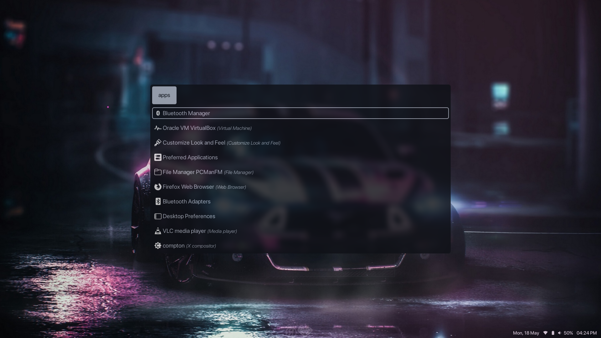

# Dotfiles

These are my dotfiles. Heh. That's obvious from the repo name.

I run a fairly minimal setup, as follows:

WM - BSPWM

Browser - Firefox

Compositor - Picom - iBhagwan's fork with rounded corners

Menu - Rofi

Terminal - Kitty

Btw I mainly use void

Screenshots:

                        Desktop

                        Appsmenu using Rofi

                        Networkmenu using Rofi
                        
 Thanks to Aditya Shakya @adi1090x for his polybar themes. His work inspired my rice!                       
 Credit to vahnrr for the original work! Here's his Gitlab repo containing the original work - https://gitlab.com/vahnrr/rofi-menus
 
 
