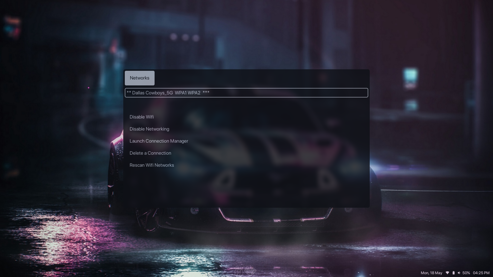

# Dotfiles

These are my dotfiles. Heh. That's obvious from the repo name.

I run a fairly minimal setup, as follows:

WM - BSPWM

Browser - Firefox

Compositor - Picom - iBhagwan's fork with rounded corners

Menu - Rofi

Terminal - Kitty

Btw I mainly use void

Screenshots:

